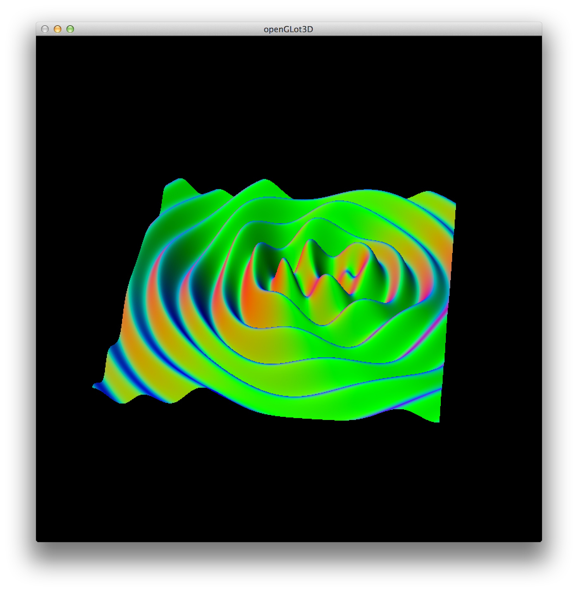
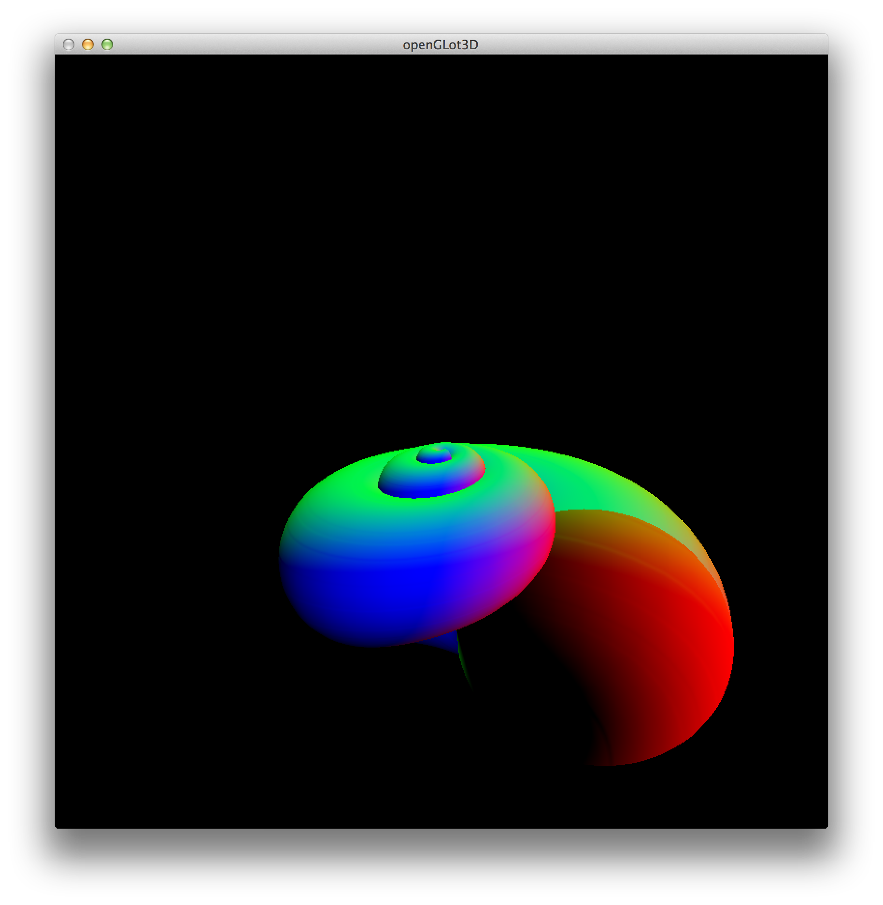
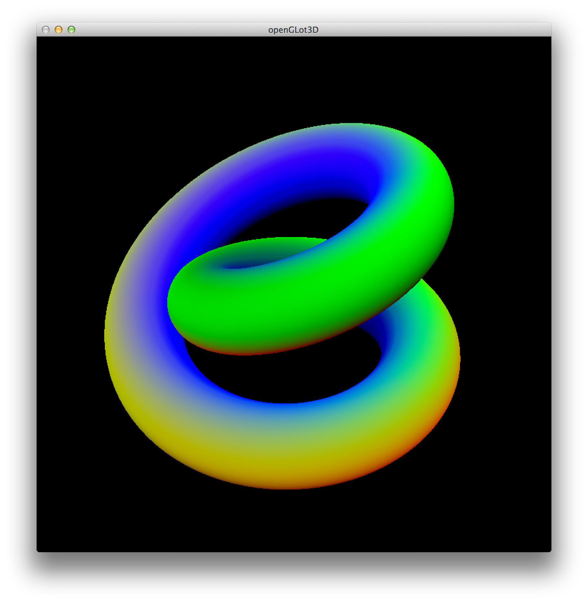

# OpenGLot3D

This was a project I worked on around 2009-2010. I'd become enamored of graphics, and was
experimenting with different techniques for visualizing mathematical concepts.

This offers a number of primitives which are then rendered on the GPU:

- parametric curves
- parametric surfaces
- surfaces

Each of these primitives also supports a term for the current time since the program is
running.

## Demos

There are demos which allow the use to provide a function to render. Some good examples
are listed by the `--help` flag on the driver:

```bash
Examples: 

  Surface:
    ./driver --surface 'sin(3.0 * sqrt(x * x + y * y) - 2.0 * t) * exp(-sqrt(x * x + y * y)/5.0) * cos(5.0 * sqrt((x - 1.5) * (x - 1.5) + (y - 0.75) * (y - 0.75)) - t)'

  Parametric surface:
    ./driver --p-surface 'pow(abs(sin(t)), u * 18.0) * (1 + cos(v * 6.0)) * cos(u * 18.0), pow(abs(sin(t)), u * 18.0) * (1 + cos(v * 6.0)) * sin(u * 18.0), pow(abs(sin(t)), u * 18.0) * sin(v * 6.0) - 1.5 * pow(abs(sin(t)), u * 18.0)'

  Toroid:
    ./driver --cylindrical --p-surface '2 * 6.3 * v, 3 + sin(6.3 * v) + cos(6.3 * u), sin(6.3 * u) + 2 * cos(6.3 * v)'

  Curve:
    ./driver --cylindrical --p-curve 'u * 19.0, (2.0 + cos(7.0 * u * 19.0 / 3.0)) * (1 +  abs(sin(t))), sin(7.0 * u * 19.0 / 3.0)'
```

## Gallery

A surface with color-encoded normals:



A seashell:



A toroid:



## State

This code does not have unit or integration tests. It has not been maintained since 2010.